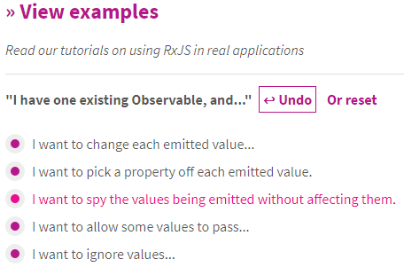

class: center, middle, inverse

# RxJS 5.0
## The What, the How and the Why

Benjamin Fox | [Intergen](http://teamintergen.com)

---

# What is RxJS?

http://reactivex.io

RxJS is the latest JavaScript implementation of the Rx library for the *reactive programming* pattern. **Rx**, or "Reactive Extensions" has been implemented in a number of languages.

Rx introduces the `Observable` type:

- Comparable to `Iterables`, and share many capabilities:
    - `map`, `filter`, `join`, `group`, etc..
    - Infinite or finite
- Comparable to `Promises`, and share many capabilities:
    - `then`/`flatMap`, `catch`, etc..
- Supports asynchronous sequences
- **Pull** vs **push**

RxJS 5.0 is written in TypeScript.

???

# What is RxJS?

RxJS is the latest JavaScript implementation of the Rx library for the *reactive programming* pattern. **Rx**, or "Reactive Extensions" has been implemented in a number of languages.

Rx introduces the `Observable` type, which provides an interface for manipulating and consuming synchronous or asynchronous sequences of data.

Observables are comparable to both *Iterables* and *Promises* - lazily evaluated sequences of data. 

Iterables may be finite or infinite and can be lazily evaluated as the consumer **pulls** data. Like Iterables, Observables can be mapped, filtered, joined, grouped, etc.

Promises represent a single future value and are evaluated when data arrives.

Observables are a combination of both: Like Promises they respond to data being **pushed** to the consumer. For this reason they expose a necessarily asynchronous interface, though they may work completely synchronously. Like Iterables, they may represent a finite or infinite sequence.

RxJS 5.0 is written in TypeScript.

---

# Observables vs Iterables

- Both can represent finite or infinite sequences

- Both provide an interface for chaining

- Both support error reporting/handling

- Only Observables can represent asynchronous results

[Iteration protocols](https://developer.mozilla.org/en/docs/Web/JavaScript/Reference/Iteration_protocols)

???

How do observables compare with promises? 

Both support finite or infinite sequences, and support chaining and manipulation of results. Both provide an interface
for error handling
- Observables provide the _error_ callback.
- Iterables may raise an error on _next_.

Only observables can represent asynchronous results.

Warning: "hot" subscriptions must be carefully disposed.

---

# Examples

### Iterables

```
// Arrays are iterable
let a = [1, 2, 3, 4];
let b = a.filter(v => v % 2 === 0)
         .map(v => v * 2);

// could raise an error
for (let val of b) {
    console.log(val);
}
```

### Observables

```
// Construct a "cold" observable
let x$ = Observable.of(1, 2, 3);
let y$ = x$.filter(v => v % 2 === 0)
           .map(v => v * 2);

y$.subscribe(
    val => console.log(val), 
    err => console.error(err),  // optional
    () => console.log('Done')   // optional
);
```

???

Both of these examples operate completely synchronously. This observable is called a _cold_ observable. We'll examine this more later. 

---

# Observables vs Promises

- Both can be synchronous or asynchonous

- Both can represent a future result

- Both provide interface to chain async code

- Both support error handling

- Only Observables can represent an empty sequence or multiple results

- Only Observables can represent ongoing events


**Important difference:** Promises represent an operation in progress. Observables *may* represent events in progress (hot), but may also be lazily evaluated (cold).


???


How do observables compare with promises? 

Both can represent some future data. 
Both support chaining. RxJS supports chaining with promises.
Both support error handling.

Only observables can represent an empty sequence, or multiple results.
Only observables can represent ongoing, asynchronous events.

Warning: "hot" subscriptions must be carefully disposed.

---

# Examples

### Promises

```
let a = Promise.resolve('Hello from promises');
let b = a.then(v => someOtherAsyncThing(v))
         .then(v => v * 2);

b.then(
    val => console.log(val),
    err => console.error(err)  // optional
);
```

### Observables

```
let x$ = Observable.of('Hello from observables');
let y$ = x$.concatMap(v => someOtherAsyncThing(v))
           .map(v => v * 2);

y$.subscribe(
    val => console.log(val), 
    err => console.error(err), // optional
    () => console.log('Done')  // optional
);
```

???

Both of these examples **should** operate completely synchronously (the Promise example may not for implementation reasons).

This observable is called a _cold_ observable. We'll examine this more later. 


---

# Getting Started

RxJS is available is two forms:

**Single file** - Install via CDN or local file.
  
- Include the file directly declares a global `Rx` namespace. 
- Include via a module loader (e.g. AMD)

> No official typings for this use-case :(


**Modular** - Install via NPM/JSPM.

Include using module import syntax. E.g. TypeScript: 

```
import { Observable } from 'rxjs/Observable';
import 'rxjs/add/operator/switchMap'; // enable switchMap operator
```

Modular imports allow you to include only the code you need on a per-operator basis, but requires a module loader like Webpack or SystemJS to deliver code.


???


RxJS 5 is written in modular TypeScript, and requires a javascript module loader to use properly. There is a global/single-file version of the library available, but no official typings exist to use with it.

With modular RxJS it is recommended that you import only the operators/functions you actually use within your application - this reduces the amount of code loaded at runtime.


---


# A few observable concepts

- **Observable** - Represents an observable event/value sequence
- **Observer** - A collection of callbacks which handle Observable events
- **Subscription** - Represents the subscription to an observable of an observer. Used for cancellation
- **Operators** - Functions for manipulating an Observable sequence, e.g. `flatMap`, `filter`
- **Subject** - An _Observable_ with an API for generating events

The **Observer** callbacks are:

- `next(value)` - Called for each event in the stream
- `error(err)` - Called when an error is emitted and the stream ends
- `complete()` - Called when the stream ends (except on an error)


???


Some terms and their definitions.

The three Observer callback functions and their behaviour map directly to the _Iterable_ interface.

- **next** - The body of the `for` loop
- **error** - An exception raised by the Iterator. This kills the loop
- **complete** - The end of the loop


---

# Hot vs Cold

There are two flavours of Observable: Hot and Cold.

- **Hot** - Emits one series of events to all subscribers. Events are temporal.

- **Cold** - Emits a new series of events to each subscriber.

Both Hot and Cold observables may be synchronous or asynchronous.

???

Hot observables emit one series of events, which are sent to each subscriber as they arrive. Events are emitted to subscribers as they occur. For example - observables based on an HTTP response, or DOM events on the page.

Cold observables emit their events for each subscriber, immediately on subscription. Every subscriber receives their own series of events (events are not shared between subscribers). For example: A static observable constructed from an array using `Observable.of`.

---


# Constructing Hot Observables


Construct a subject:

```
let s$ = new Subject();
s$.next(new Foo());
s$.complete();
```

Construct from an event:

```
let o3$ = Observable.fromEvent(buttonElement, 'click');
```

Construct from a promise:

```
let o5$ = Observable.fromPromise(promise);
```

???

Hot observables emit only one series of events, which are sent to each subscriber as they arrive. Events are emitted to subscribers as they occur.

Importantly, if a subscriber is late to the party they will **not** receive events emitted before they subscribe (though there are operators which can change this behavior).

Observables constructed from a Promise occupy a grey area between hot and cold - They emit a value and complete when the underlying Promise completes (Hot), but any future subscribers will also receive the cached value (Cold) - i.e. they behave just like promises.

---


# Constructing Cold Observables

Construct a cold, finite observable:

```
let o1$ = Observable.of(1, 2, 3);
```

Construct a cold, dynamic observable:

```
let o2$ = Observable.create((observer) => {
    observer.next(1);
    observer.complete();
});
```


???

Cold observables emit their events for each subscriber, immediately on subscription.

Every subscriber receives their own series of events (events are not shared).

If the events are emitted synchronously, then the `next` callback will fire for every event before `subscribe` event exits.

Cold observables can be thought of as an "event factory".

---


# Operators

RxJS ships with a huge collection of **operators** - functions used to manipulate observable sequences.

The RxJS Documentation has a wizard for finding operators!

.center[


[RxJS Documentation](http://reactivex.io/rxjs/)
]


???


RxJS ships with a fairly confusing list of operators. There is no need to use (or even import) them all.

If you are doing something new however, consider using the Wizard on the RxJS documentation to help you find the right operator for the job.


---


# Operator examples

### filter

Filters events to downstream subscribers.

```
obs$.filter(val => val > 0)
```

### map

Transforms events for downstream subscribers.

```
obs$.map(val => val * 2)
```

### do

Observes events without modifying the stream.

```
obs$.do(val => console.log(val))
```


---


# Operator examples

### timeout

Raises an error on the stream if the stream times out.

```
obs$.timeout(500)
```

### debounce

Debounces events on the stream.

```
obs$.debounce(500)
```

### delay

Delays all events on the stream by a fixed time.

```
obs$.delay(500)
```

???

Debounce - events are only emitted if more than N milliseconds apart.

---


# Operator examples

### merge

Combines events from multiple Observables into a single stream.

```
Observable.merge(obs1$, obs2$)
```

### race

Emits events only from the first observable to emit an event.

```
Observable.race(obs1$, obs2$)
```


???

Merge - Merges two Observables into a single stream. Because it relies on events being temporal, this operator behaves differently with synchronous and asynchronous observables!


---


# An advanced operator

### switchMap

Construct a new Observable for each value on the stream, then switch to emitting values from that observable.

This can be used, for instance, to easily construct an asynchronous type-ahead lookup.

```
let input$ = Observable.fromEvent(textbox, 'keydown').map(e => textbox.text);
let values$ = input$.switchMap(text => asyncApiLookup(text));

values$.subscribe(data => {
    updateTypeaheadDropdown(data);
});
```

`values$` only emits data when the API request completes and _is not superceded_ by another keypress.


???


Every event on the `input$` stream (triggered by a keypress) kicks off a new request to the server.

Importantly, however - when `switchMap` subscribes to the new observable, it _unsubscribes_ from the old observable. `values$` only emits values from the _most recent_ observable.

It is worth noting that `switchMap` ignores "complete" events on the child observable, but not "error" events.


---

class: center, middle, inverse

# Demo

???

# Demo 1

## Add imports

    // These are done once per project
    import 'rxjs/add/observable/fromEvent';
    import 'rxjs/add/operator/switchMap';

    import { Observable } from 'rxjs/Observable';


## Add basic implementation

    let input$ = Observable.fromEvent(textbox, 'keyup').map(e => textbox.value);
    let values$ = input$.switchMap(searchTerm => getDataAsync(searchTerm));

    values$.subscribe(data => {
        updateOutput(data);
    });

## Debounce

    import 'rxjs/add/operator/debounceTime';

Add `.debounceTime(300)` to values$ definition.


# Add "initial" value to input

    import 'rxjs/add/operator/startWith';

Add `.startWith('')` to values$ definition.


---


# Cleaning up after yourself

Subscriptions must be manually cleaned up when:

- Subscribed to an infinite sequence
- Subscribed to a finite but long-running and incomplete observable

Failure to do so can lead to object leaks!

```
// Observable lives for lifetime of app!
let o$ = App.acquireGrandCentralDispatch();

// Potential leak of `this`!
this.sub1 = o$.subscribe(e => this.handleEvent(e));
```

When the user navigates away from your component...

```
// Leak sorted
this.sub1.unsubscribe();
```

???

When subscribing to observables it may be necessary to clean up after yourself.

For example, a UI component may subscribe to some central event bus to receive notifications of global events.

When the user dismisses your UI component, you _must_ clean up your subscription, or risk leaking objects.

Keeping track of lots of subscriptions can become tedious, though...


---


# Cleaning up (advanced)

Instead, you can use the `_destroyed$` pattern to automatically clean up subscriptions.

```
// Stored as member variable of your component
this._destroyed$ = new Subject();

App.acquireGrandCentralDispatch()
    .takeUntil(this._destroyed$)
    .subscribe(e => this.handleEvent(e));
```

When the user navigates away from your component...

```
_destroyed$.next();
```

???

Use the `_destroyed$` pattern instead! This takes advantage of the fact that subscriptions are automatically cleaned up when a stream errors or completes.

Consider writing a tslint lint to check for `_destroyed`...


---

class: center, middle, inverse

# Demo

???

# Demo 2

## Track the subscription and dispose

    import { Subscription } from 'rxjs/Subscription';

    private _sub: Subscription;

    this._sub = ...;

    this._sub.unsubscribe();

## Use _destroyed$ pattern

    import 'rxjs/add/operator/takeUntil';
    
    import { Subject } from 'rxjs/Subject';
    
    private _destroyed$ = new Subject();
    
    .takeUntil(this._destroyed$)
    
    this._destroyed$.next();

---


# Unit testing

- Many tests involving Observables must be **async** tests!
- Be aware of the differences between...
    + Hot and Cold observables
    + Synchronous and Asynchronous observables

E.g. Sync...

```
let o1$ = Observable.of(1, 2, 3);
let o2$ = Observable.of(4, 5, 6);
let result$ = Observable.merge(o1$, o2$); // 1, 2, 3, 4, 5, 6
```

vs Async...

```
let o1$ = makeRealAsyncSequence(1, 2, 3);
let o2$ = makeRealAsyncSequence(4, 5, 6);
let result$ = Observable.merge(o1$, o2$); // 1, 4, 2, 5, 3, 6
```


???

It is important to be aware of the differences between hot/cold and sync/async  observables. You app may unwittingly depend on the behaviour of one or the other, which you will then need to mock carefully.


---

class: middle

.center[
# Additional resources
]

- [RxJS Documentation](http://reactivex.io/rxjs/)
- [Rx Marbles](http://rxmarbles.com/) - A visualization tool for Rx operators